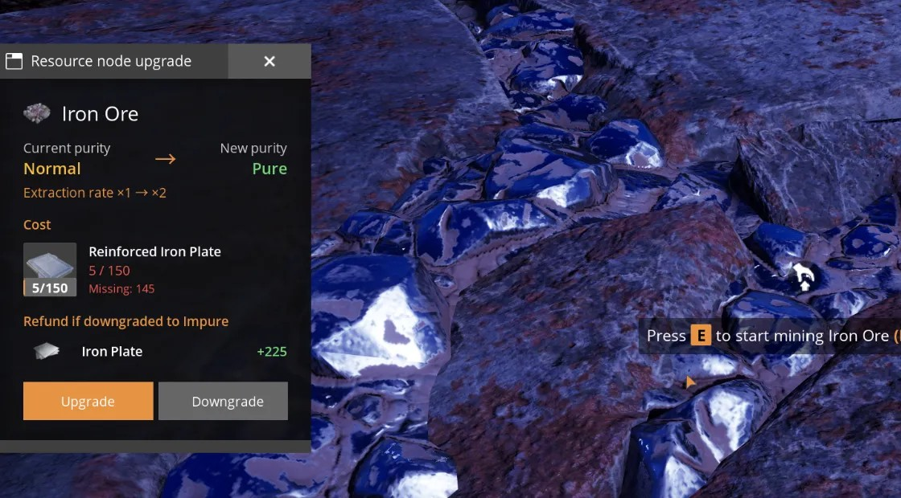
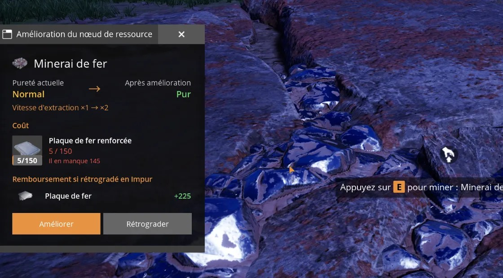

# Node Upgrade

A Satisfactory mod: pay items to raise or lower the purity of any resource node (**Impure → Normal → Pure**). Miners and extractors already built on the node run at the new speed immediately.

**Download and full description: [ficsit.app/mod/NodeUpgrade](https://ficsit.app/mod/NodeUpgrade)**, or install it with Satisfactory Mod Manager.

## Features
- Native-looking menu (key **Y**, rebindable): built from the game's own window, buttons, cost slots, icons and fonts.
- Instant effect on miners and extractors already standing on the node.
- Downgrade refunds 50% of what was actually paid for that step, rounded down; a node never goes below its original purity.
- Payment and purity change happen together or not at all.
- Saved with the game; no tick and no scan of the map.
- Editable costs in `Resources/costs.json` (`/nu reload` in the chat).
- 13 languages, following the game language.

## Building from source
1. Set up the Satisfactory modding environment (Unreal Engine CSS, Visual Studio 2022, Wwise, SML starter project) as described in the [official modding documentation](https://docs.ficsit.app/satisfactory-modding/latest/).
2. Put the contents of this repository in `Mods/GameFeatures/NodeUpgrade/` of the starter project.
3. Generate the Visual Studio project files, build **Development Editor / Win64**, then package **NodeUpgrade** with Alpakit.

Built against SML 3.12 and game version CL502094 (Satisfactory 1.2). Windows only.

| Folder | Contents |
|---|---|
| `Source/` | All the C++ code (menu, rules, save data, targeting, chat commands). |
| `Content/` | The input action, the input mapping context, the Game Feature Data asset and the translations (`Localization/`). |
| `Resources/` | `costs.json` (prices per resource) and the in-game icon. |
| `Config/` | Alpakit and access transformer settings. |

## AI usage
This mod was made with the help of an AI assistant (Anthropic Claude): the C++ code, the translations (not yet reviewed by native speakers), the logo and these texts were written by the AI, following the author's design. Game design, balancing and in-game testing were done by the author.

The menu follows the game language (here in French):

## License
[MIT](LICENSE) for the mod's own code and files.

## Credits
Satisfactory, its item icons and its UI assets belong to Coffee Stain Studios. This mod is not affiliated with Coffee Stain Studios.
